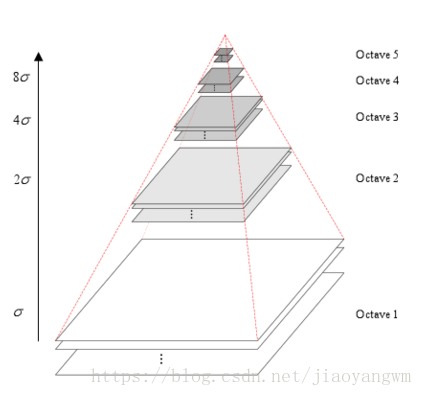
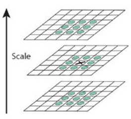
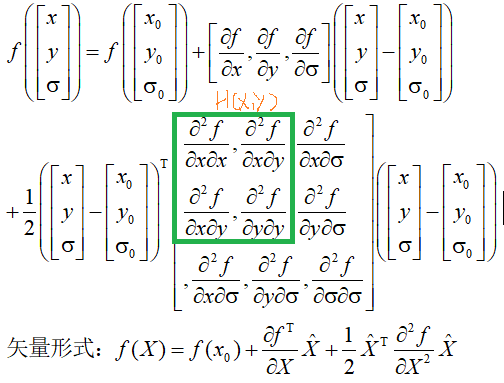
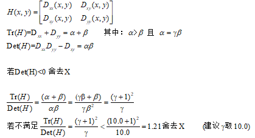
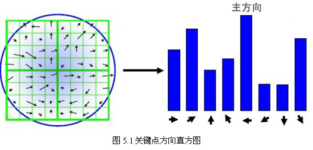
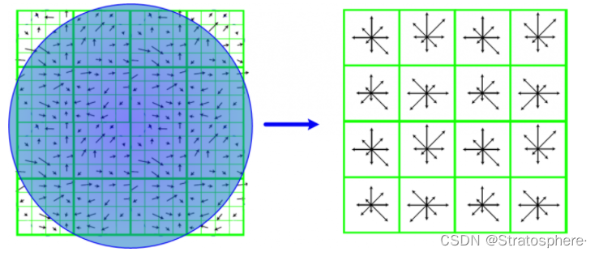

# SIFT 用于图像匹配
## 1、概述
&emsp;&emsp;匹配的核心问题是将同一目标在不同时间、不同分辨率、不同光照、不同方向的情况下所成的像对应起来。提取的表征应该对旋转、仿射变换、光照、噪声有一定的鲁棒性。这也是SIFT算法的出发点，其步骤为：
1. 提取关键点：搜索所有尺度上的图像位置。通过高斯微分函数来识别潜在的对于尺度和旋转不变的兴趣点。
2. 确定关键点：在每个候选的位置上，通过一个拟合精细的模型来确定位置和尺度。关键点的选择依据于它们的稳定程度。
3. 方向确定：基于图像局部的梯度方向，分配给每个关键点位置一个或多个方向。所有后面的对图像数据的操作都相对于关键点的方向、尺度和位置进行变换，从而提供对于这些变换的不变性。
4. 关键点描述：在每个关键点周围的邻域内，在选定的尺度上测量图像局部的梯度。基于该梯度构造描述符。

## 2、提取关键点
#### 2.1 高斯金字塔的建立
&emsp;&emsp;人眼对图像尺度具有较好的鲁棒性，然而计算机要有相同的能力却很难，其中的一种方法是把物体不同尺度下的图像都提供给机器，让机器能够对物体在不同尺度下有一个统一的认知。
&emsp;&emsp;鉴于此，我们构造一个尺度空间以模拟人眼看到物体的远近程度以及模糊程度，又考虑到：*高斯卷积核是实现尺度变换的唯一变换核*，我们在降采样前采取高斯核函数进行滤波，使原始图像保存最多的细节特征。
&emsp;&emsp;每个像素的值都是周围相邻像素值的加权平均，而采用高斯核函数时该权重由下式计算得到：$(x, y)$ 到 $(x_0, y_0)$ 的权重
$$
\alpha(x, y)=\frac{1}{2\pi \sigma^2}\cdot e^{-\frac{(x-x_0)^2+(y-y_0)^2}{2\sigma^2}}
$$
&emsp;&emsp;考虑到正态分布的 $3\sigma$ 原则，实际操作中是采用 $(6\sigma+1)\times(6\sigma+1)$ 卷积实现。$\sigma$ 反映了图像被模糊的程度。
&emsp;&emsp;那么基于此高斯核卷积，我们可以得到不同尺度空间并可以将其堆叠成高斯金字塔，同时为了使尺度体系具有连续性，在同一尺度下应用了不同 $\sigma$ 的高斯核卷积。（同一尺度不同 $\sigma$ 称组，不同尺度称层）（[图源]([(5条消息) SIFT算法简介_呆呆的猫的博客-CSDN博客_sift算法](https://blog.csdn.net/jiaoyangwm/article/details/79986729?ops_request_misc=%7B%22request%5Fid%22%3A%22165302570516781685347848%22%2C%22scm%22%3A%2220140713.130102334..%22%7D&request_id=165302570516781685347848&biz_id=0&utm_medium=distribute.pc_search_result.none-task-blog-2~blog~sobaiduend~default-5-79986729-null-null.nonecase&utm_term=sift算法&spm=1018.2226.3001.4450))）

&emsp;&emsp;设金字塔有 $O$ 组，每组 $s$ 层（一般取6），每组待提取图像特征的图像数为 $n=s-3$（后续需要差分，而差分后第一张和最后一张无法提取特征），有：
$$
O=\log_2\min(H,L)-a,\ a\in[0, \log_2\min(H,L))
$$
&emsp;&emsp;$a$ 和具体需要的金字塔的顶层图像的大小有关。对 $\sigma$ 我们有：
$$
\sigma(o,s)=\sigma_0 2^{o+\frac{r}{n}}\\ where\ o\in\{0,1,\cdots,O-1\},\ r\in\{0, \cdots, n+2\}
$$
&emsp;&emsp;$\sigma_0$ 为高斯模糊初始值。对于式3，若 $n=3$，我们有：
$$
\sigma(o,s)=\sigma_0 2^{o+\frac{r}{3}}=\sigma_0 2^o(2^{\frac{1}{3}})^r
\\ where\ o\in\{0,1,\cdots,O-1\},\ r\in\{0, \cdots, 5\}
$$
* 每一组内，相邻层之间的高斯模糊系统相差 $2^{\frac{1}{3}}$
* 第 $o$ 组第0层高斯模糊系数为 $\sigma_02^o$
* 下一组的第0层为上一组倒数第3层降采样所得，无须进行高斯模糊操作。
* 图片越来越模糊，这与我们的直觉认知也是一致的。

#### 2.2 关键点的确定
&emsp;&emsp;为了检测在不同尺度空间下的图像均具有的含有方向信息的局部极值点（边缘特征点），较好的算子是高斯拉普拉斯（LoG）：
$$
\nabla^2=\frac{\partial^2}{\partial x^2}+\frac{\partial^2}{\partial y^2}
$$
&emsp;&emsp;实际操作中我们用差分来近似微分：使用DoG（差分高斯，Different of Gaussian）来近似计算LoG，其在计算上只需与相邻尺度下高斯平滑后图像比较。
&emsp;&emsp;我们使每一组内两两相减以得到高斯差分金字塔：

&emsp;&emsp;为了寻找尺度空间的极值点，每个像素点要和其图像域（同一尺度空间）和尺度域（相邻的尺度空间）的所有相邻点进行比较，当其大于（或者小于）所有相邻点时，该点就是极值点。如图所示，中间的检测点要和其所在图像的3×3邻域8个像素点，以及其相邻的上下两层的3×3领域18个像素点，共26个像素点进行比较。

&emsp;&emsp;由于高斯差分金字塔是离散的(因为尺度空间和像素点都是离散的)，所以找到的极值点不太准确的，我们需要找到更高亚像素位置精度的极值点。考虑：

&emsp;&emsp;对 $X$ 求导，可以得到极值点的偏移量 $\hat{X}$ 为：
$$
\hat{X}=-\frac{\partial^2f^{-1}}{\partial^2 X^2}\frac{\partial f}{\partial X}
$$
&emsp;&emsp;带入 $f(X)$，有：
$$
f(\hat{X})=f(X)+\frac{1}{2}\frac{\partial{f^\top}}{\partial X}\hat{X}
$$
&emsp;&emsp;当 $\hat{X}$ 在任一维度上的偏移量大于0.5时，意味着插值中心已经偏移到它的邻近点上，所以必须改变当前关键点的位置。同时在新的位置上反复插值直到收敛。
&emsp;&emsp;此外我们还应消除关键点的边缘效应：本质上要去掉DoG局部曲率非常不对称的像素。 一个定义不好的高斯差分算子的极值在横跨边缘的地方有较大的主曲率，而在垂直边缘的方向有较小的主曲率。主曲率通过一个2×2的海森矩阵求出：

#### 2.3 关键点方向的确立
&emsp;&emsp;经过上述过程，我们已经得到了图像中的极值点。接下来，我们需要通过极值点的一系列信息，计算出极值点的主方向，这个方向代表了这个极值点所处的邻域的像素点主要变化方向，反映到图像上则代表着附近颜色变化的主要方向。采集其所在高斯金字塔图像 $3\times1.5\sigma$ 领域窗口内像素的梯度和方向分布特征。梯度的模值和方向如下：
$$
m(x,y)=\sqrt{(L(x+1,y)-L(x-1,y))^2+(L(x,y+1)-L(x,y-1))^2}\\
\theta{(x,y)}=\arctan{\frac{L(x,y+1)-L(x,y-1)}{L(x+1,y)-L(x-1,y)}}
$$
&emsp;&emsp;在完成关键点的梯度计算后，使用直方图统计领域内像素的梯度和方向。梯度直方图将 0~360 度的方向范围分为36个柱，其中每柱10度。在将梯度的模值累加到直方图时，乘以一个高斯权重。选择直方图中最大累加值的角度作为主方向，把超过最大角度累加值*peak_ratio（0.8）的角度作为该关键的辅方向。

## 3. 构造描述符
&emsp;&emsp;经历过上述一系列复杂的操作后，得到了每一个关键点的位置、尺度和主方向信息，在接下来，需要根据关键点生成描述子。我们使用在关键点尺度空间内 $4\times4$ 的种子窗口中计算的8个方向的梯度信息，共 $4\times4\times8=128$ 维向量表征：

&emsp;&emsp;首先，为满足方向不变性，需要将统计的像素点都旋转到以关键点主方向为x轴的坐标系下：
$$
\begin{bmatrix}
x'\\y'
\end{bmatrix}
=\begin{bmatrix}
cos\theta & -sin\theta\\sin\theta & cos\theta
\end{bmatrix}\begin{bmatrix}
x\\y
\end{bmatrix}
$$
&emsp;&emsp;而后类似于求主方向，此时每个种子区域的梯度直方图在0-360之间划分为8个方向区间，每个区间为45度，即每个种子点有8个方向的梯度强度信息。